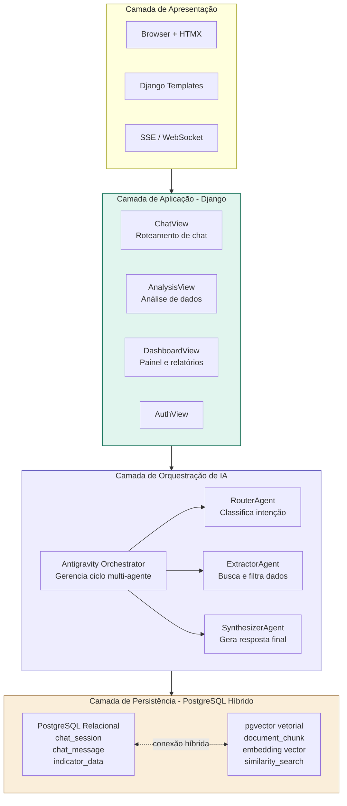
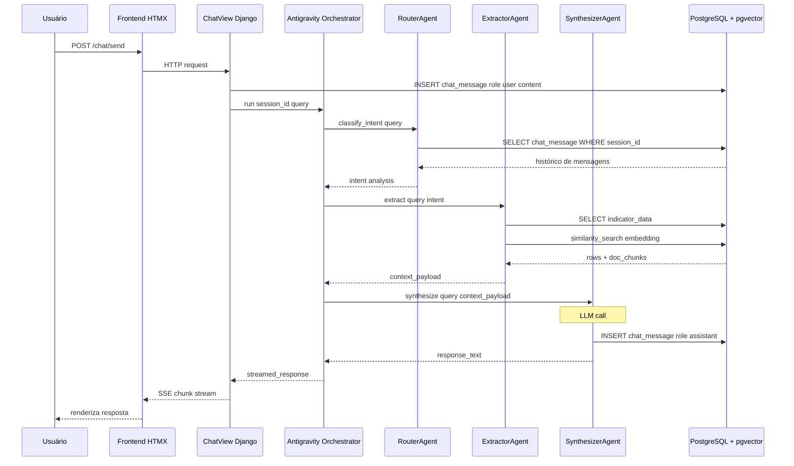

# Especificação Técnica: SocioEcoInsight

O **SocioEcoInsight** é uma plataforma web que expõe dashboards socioeconômicos reais do Brasil consumindo a API do IBGE, e integra um Chatbot RAG Multi-Agente orquestrado pelo framework Antigravity. O sistema permite realizar consultas analíticas e semânticas avançadas em linguagem natural, utilizando PostgreSQL com a extensão pgvector para armazenamento e busca híbrida (relacional e vetorial).

## Arquitetura de Componentes

O projeto segue os princípios de Clean Architecture adaptados para o ecossistema Django, separando responsabilidades em camadas distintas:

1. **Camada de Apresentação (Presentation)**:
   - Interface web utilizando Django Templates e HTMX para interações assíncronas.
   - Componentes visuais com TailwindCSS.
   - Renderização de gráficos com Chart.js.
   - Comunicação via SSE (Server-Sent Events) ou WebSocket para streaming da resposta da IA.

2. **Camada de Aplicação (Application / Infrastructure)**:
   - **Django Views**: `ChatView` (roteamento), `AnalysisView` (processamento do dashboard).
   - **Gerenciamento de Comandos (ETL)**: Pipeline assíncrono para ingestão de dados da API SIDRA do IBGE (Inflação, Desemprego).

3. **Camada de Orquestração de IA (Domain / Services)**:
   - **Antigravity Orchestrator**: Framework de coordenação Multi-Agente.
   - **RouterAgent**: Analisa a intenção da query e roteia para a ação adequada.
   - **ExtractorAgent**: Recupera o contexto no banco (buscas relacionais e de similaridade vetorial via embeddings).
   - **SynthesizerAgent**: Sintetiza a resposta em linguagem natural consolidando contexto e aplicando raciocínio.

4. **Camada de Persistência (PostgreSQL Híbrido)**:
   - Armazenamento relacional para métricas históricas (`MetricaSocioEconomica`).
   - Armazenamento vetorial via `pgvector` para notas metodológicas (`DocumentoMetodologico`).

---

### Diagrama 1: Arquitetura de Componentes

### Diagrama 2: Sequência do Fluxo Chat (RAG Multi-Agente)

